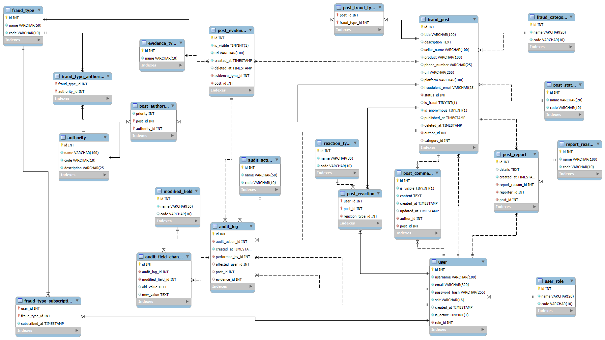

# Documentación de la base de datos

En este documento se describe la estructura general, las convenciones y las decisiones de diseño de la base de datos de Cero Fraude.

## Contenido

- [1. Descripción general](#1-descripción-general)
- [2. Estructura de la base de datos](#2-estructura-de-la-base-de-datos)
- [3. Relaciones principales](#3-diagrama-de-la-base-de-datos)
- [4. Relaciones principales](#4-relaciones-principales)
- [5. Convenciones](#5-convenciones)
- [6. Decisiones de diseño](#6-decisiones-de-diseño)
- [7. Inicialización de la base de datos](#7-inicialización-de-la-base-de-datos)
- [8. Archivos relacionados](#8-archivos-relacionados)

## 1. Descripción general
El propósito principal de la base de datos de Cero Fraude es almacenar y gestionar la información necesaria para el registro y consulta de publicaciones sobre posibles ofertas fraudulentas. Además, permite administrar la información relacionada con los usuarios, evidencias, reportes, comentarios, reacciones, suscripciones y demás elementos necesarios para el funcionamiento del sistema.

## 2. Estructura de la base de datos
La base de datos está organizada de acuerdo con la función que desempeñan las tablas dentro del sistema. Incluye catálogos, tablas para la gestión de usuarios y publicaciones, interacciones con las publicaciones, relaciones con tipos de fraude y autoridades, y registros de auditoría.

### 2.1 Catálogos
Esta sección contiene las tablas que almacenan valores predefinidos utilizados por los distitnos componentes del sistema.

| Tabla            | Descripción                                                                                           |
| :--------------- | :---------------------------------------------------------------------------------------------------- |
| `user_role`      | Define los roles disponibles para los usuarios del sistema                                            |
| `post_status`    | Define los posibles estados de una publicación                                                        |
| `reaction_type`  | Define los tipos de reacción disponibles para las publicaciones                                       |
| `fraud_category` | Define las categorías utilizadas para indicar el contexto o medio de que provino una oferta reportada |
| `fraud_type`     | Define los tipos de fraude que pueden asociarse a una publicación                                     |
| `audit_action`   | Define los tipos de acciones que pueden registrarse en el historial de auditoría                      |
| `report_reason`  | Define los motivos disponibles para reportar una publicación                                          |
| `evidence_type`  | Define los formatos de evidencia que pueden asociarse a una publicación                               |
| `modified_field` | Define los campos cuyo cambio puede registrarse en el historial de auditoría                          |
| `authority`      | Almacena las autoridades a las que se puede recurrir ante los distintos tipos o casos de fraude       |

La descripción y los valores definidos para cada catálogo se encuentran en [`catalogs.md`](./catalogs.md).

### 2.2 Usuarios
Esta sección contiene las tablas relacionadas con la información y gestión de los usuarios del sistema.

| Tabla  | Descripción                                                       |
| :----- | :---------------------------------------------------------------- |
| `user` | Almacena la información de los usuarios registrados en el sistema |

### 2.3 Publicaciones
Esta sección contiene las tablas relacionadas con las publicaciones sobre posibles ofertas fraudulentas.

| Tabla        | Descripción                                                                                                                                                                              |
| :----------- | :--------------------------------------------------------------------------------------------------------------------------------------------------------------------------------------- |
| `fraud_post` | Almacena las publicaciones realizadas por los usuarios sobre posibles ofertas fraudulentas, incluyendo los borradores que pueden conservar información incompleta durante su elaboración |

### 2.4 Contenido e interacciones de las publicaciones
Esta sección contiene las tablas relacionadas con el contenido asociado a las publicaciones y las interacciones realizadas por los usuarios.

| Tabla           | Descripción                                                                                                             |
| :-------------- | :---------------------------------------------------------------------------------------------------------------------- |
| `post_report`   | Almacena los reportes realizados por los usuarios sobre publicaciones por alguno de los motivos definidos en el sistema |
| `post_evidence` | Almacena las evidencias asociadas con una publicación o borrador                                                        |
| `post_comment`  | Almacena los comentarios realizados por los administradores en las publicaciones                                        |
| `post_reaction` | Registra las reacciones de los usuarios a las publicaciones                                                             |

### 2.5 Relaciones con tipos de fraude
Esta sección contiene las tablas que permiten relacionar los tipos de fraude con los usuarios y publicaciones.

| Tabla                     | Descripción                                                                |
| :------------------------ | :------------------------------------------------------------------------- |
| `fraud_type_subscription` | Registra las suscripciones de los usuarios a los distintos tipos de fraude |
| `post_fraud_type`         | Relaciona las publicaciones con los tipos de fraude asociados              |

### 2.6 Referencias a autoridades
Esta sección contiene las tablas que relacionan las autoridades con los tipos de fraude y con publicaciones específicas.

| Tabla                  | Descripción                                                                                       |
| :--------------------- | :------------------------------------------------------------------------------------------------ |
| `fraud_type_authority` | Relaciona los tipos de fraude con las autoridades que pueden atender casos de ese tipo            |
| `post_authority`       | Relaciona publicaciones específicas con las autoridades correspondientes y establece su prioridad |

### 2.7 Auditoría
Esta sección contiene las tablas utilizadas para registrar acciones relevantes realizadas dentro del sistema.

| Tabla                | Descripción                                                                                                                                                                              |
| :------------------- | :--------------------------------------------------------------------------------------------------------------------------------------------------------------------------------------- |
| `audit_log`          | Registra las acciones relevantes realizadas en el sistema, incluyendo información sobre quién realizó la acción, cuándo ocurrió y, dependiendo del caso, el usuario, publicación o evidencia afectada |
| `audit_field_change` | Registra los campos modificados como parte de una acción almacenada en `audit_log`, incluyendo el valor anterior y el nuevo valor                                                        |

## 3. Diagrama de la base de datos
El siguiente diagrama muestra de forma visual las tablas de la base de datos y las relaciones existentes entre ellas.



## 4. Relaciones principales
Las relaciones principales entre las entidades de la base de datos son:

- Cada usuario tiene asignado un rol, mientras que un rol puede estar asociado con múltiples usuarios
- Un usuario puede crear múltiples publicaciones, mientras que cada publicación pertenece a un único usuario
- Cada publicación tiene asignado un estado y puede estar asociada con una categoría. La categoría puede permanecer vacía mientras la publicación se encuentra en elaboración
- Una publicación puede estar asociada con múltiples tipos de fraude, y un tipo de fraude puede estar asociado con múltiples publicaciones
- Una publicación puede contener múltiples evidencias y comentarios
- Los usuarios pueden reaccionar a múltiples publicaciones, y cada publicación puede recibir reacciones de múltiples usuarios
- Los usuarios pueden reportar publicaciones, indicando uno de los motivos de reporte definidos en el sistema
- Un usuario puede suscribirse a múltiples tipos de fraude, y cada tipo de fraude puede tener múltiples usuarios suscritos
- Un tipo de fraude puede estar relacionado con múltiples autoridades, y una autoridad puede estar relacionada con múltiples tipos de fraude
- Una publicación puede estar relacionada directamente con múltiples autoridades, y una autoridad puede estar relacionada con múltiples publicaciones
- El historial de auditoría relaciona las acciones registradas con el usuario que las realizó y, dependiendo de la acción, con el usuario, publicación o evidencia afectada. Una acción puede registrar múltiples cambios mediante `audit_field_change`, y cada cambio identifica el campo modificado mediante `modified_field`


## 5. Convenciones
Las siguientes convenciones se utilizan para mantener consistencia en la estructura y los datos de la base de datos.

### 5.1 Nomenclatura
Para mantener consistencia en la base de datos, se utilizan las siguientes convenciones de nomenclatura:

- Los nombres de las tablas, columnas, restricciones e identificadores técnicos se escriben en inglés
- Se utiliza `snake_case` para los nombres de tablas, columnas y restricciones
- Los nombres de las tablas se escriben en singular
- Las tablas que representan relaciones utilizan nombres que identifican las entidades relacionadas
- Las llaves primarias utilizan el nombre `id`, excepto en las tablas asociativas que usan una llave primaria compuesta
- Las columnas que funcionan como llaves foráneas utilizan el sufijo `_id`
- Las columnas de tipo booleano utilizan nombres que expresan una condición mediante el prefijo `is_`
- Las columnas que registran una fecha y hora utilizan nombres descriptivos con el sufijo `_at`
- Las restricciones de llave foránea utilizan el prefijo `fk_` seguido de información que identifica la tabla y la relación correspondiente
- Las restricciones de unicidad utilizan el prefijo `uq_` seguido de información que permita identificar la tabla y los campos involucrados

### 5.2 Catálogos
Los catálogos almacenan valores predefinidos que permiten mantener consistencia en la información utilizada por el sistema:

- Cuando un catálogo contiene los campos `code` y `name`, `code` se utiliza como identificador interno del valor, mientras que `name` contiene el nombre que puede mostrarse al usuario
- Los valores de `code` se escriben en inglés y en mayúsculas utilizando `SNAKE_CASE`, siguiendo la misma convención utilizada para los identificadores del sistema
- Los valores de `name` se escriben en español, ya que corresponden a información que puede ser presentada al usuario
- Los códigos deben permanecer estables para permitir que sean utilizados como identificadores dentro del sistema, independientemente del texto mostrado al usuario
- Los valores iniciales de los catálogos se definen en `seed.sql`

La descripción y los valores definidos para cada catálogo se encuentran en [`catalogs.md`](./catalogs.md).


## 6. Decisiones de diseño

### Acceso a las publicaciones según su estado
El acceso y las acciones disponibles sobre una publicacion dependen de la etapa en la que se encuentre dentro del sistema.

| Estado      | Autor                                              | Administrador             | Público         |
| :---------: | :------------------------------------------------- | :------------------------ | :-------------- |
| `DRAFT`     | Puede consultar y editar                           | Sin acceso                | Sin acceso      |
| `UPLOADED`  | Puede consultar y editar                           | Puede consultar y moderar | Sin acceso      |
| `PUBLISHED` | Puede consultar, modificar su anonimato y eliminar | Puede consultar y editar  | Puede consultar |
| `VALIDATED` | Puede consultar, modificar su anonimato y eliminar | Puede consultar y editar  | Puede consultar |
| `REJECTED`  | Puede consultar y eliminar                         | Puede consultar           | Sin acceso      |

Las publicaciones eliminadas lógicamente mediante `deleted_at` dejan de estar disponibles públicamente independientemente de su estado. Su información permanece almacenada para conservar la trazabilidad correspondiente.

### 6.1 Separación entre categorías y tipos de fraude
Se decidió modelar `fraud_category` y `fraud_type` como conceptos independientes. Cada publicación pertenece a una sola categoría, ya que esta representa el medio del que provino la oferta, mientras que una publicación puede estar asociada con múltiples tipos de fraude. 

Dicha separación permite agrupar y filtrar las publicaciones por categoría, así como identificar qué tipos de fraude se presentan con mayor frecuencia dentro de cada una, facilitando al usuario la identificación de tendencias y la prevención de posibles fraudes.

### 6.2 Asociación de autoridades con tipos de fraude y publicaciones
Se decidió mantener dos relaciones diferentes para gestionar las autoridades recomendadas: `fraud_type_authority` y `post_authority`.

`fraud_type_authority` relaciona cada tipo de fraude con las autoridades que pueden atender casos de ese tipo. Estas relaciones se utilizan como sugerencias durante la revisión de una publicación y no determinan directamente las autoridades que se mostrarán al usuario.

Debido a que una publicación puede estar asociada con múltiples tipos de fraude, las autoridades sugeridas por cada uno pueden coincidir o ser diferentes. Durante la validación, el administrador puede consultar las autoridades asociadas con los tipos de fraude de la publicación.

Cuando una publicación es validada como fraudulenta, el administrador puede seleccionar las autoridades que considere pertinentes, agregar o quitar autoridades y establecer el orden en el que serán recomendadas. La selección final se almacena en `post_authority`.

En dicha relación se incluye el campo `priority`, que determina el orden en el que se recomiendan las autoridades para una publicación específica. Un valor de `1` corresponde a la primera autoridad recomendada, `2` a la segunda y así sucesivamente.

En la interfaz administrativa, el administrador establece la prioridad mediante el orden de las autoridades seleccionadas, sin introducir manualmente el valor numérico. En la aplicación se muestra inicialmente la autoridad con `priority = 1`, mientras que las demás pueden consultarse al desplegar la sección correspondiente.

Las publicaciones que son validadas como no fraudulentas no reciben autoridades recomendadas. Si una publicación previamente validada como fraudulenta se vuelve a validar y el resultado cambia a no fraudulento, las autoridades asociadas con la publicación en `post_authority` se eliminan.

Los cambios realizados sobre la selección y prioridad de las autoridades no se registran en el historial de auditoría.

### 6.3 Anonimato de las publicaciones
Se decidió mantener la relación entre cada publicación y su autor mediante `author_id`, incluso cuando el usuario elige publicar de forma anónima mediante `is_anonymous`.

El anonimato se aplica únicamente a la información mostrada públicamente. Cuando `is_anonymous` es verdadero, la identidad del autor no se muestra a los demás usuarios, sin embargo, el sistema conserva la relación con el usuario que creó la publicación para permitir su gestión y permitir trazabilidad.

Los administradores pueden identificar al autor cuando sea necesario para realizar tareas de administración o moderación. Asimismo, el autor puede reconocer la publicación como propia y conservar las acciones disponibles sobre sus publicaciones, independientemente de que haya sido publicada de forma anónima.

### 6.4 Gestión y visibilidad de las evidencias
Se decidió mantener separada la existencia de una evidencia de su visibilidad mediante el campo `is_visible`. Una evidencia puede conetner información relevante par la revisión y comprensión del caso, pero al mismo tiempo incluir información sensible del usuario que no sea apropiado mostrar públicamente.

Mientras una publicación se encuentra en estado `DRAFT` o `UPLOADED`, el autor puede agregar o eliminar sus evidencias. Una vez que la publicación pasa a `PUBLISHED` o `VALIDATED`, el autor deja de poder modificarlas.

Los administradores no tienen acceso a las evidencias mientras la publicación permanece en estado `DRAFT`. A partir de `UPLOADED`, pueden consultar las evidencias y, como parte de las tareas de moderación, agregar nuevas evidencias, eliminar aquellas que no deban conservarse y controlar su visibilidad.

Durante el proceso de moderación, el administrador puede ocultar una evidencia cuando determine que contiene información sensible. La evidencia permanece almacenada y asociada con la publicación para conservar la información relevante del caso, pero deja de mostrarse públicamente a los demás usuarios.

Una evidencia relevante que contenga información sensible puede conservase con `is_visible = FALSE` y cuando sea necesario mostrar públicamente parte de su contenido, puede agregarse una versión censurada como una nueva evidencia visible, manteniendo la versión original oculta.

Una vez que la publicación ha sido enviada y pasa a `UPLOADED`, la eliminación de evidencias se realiza de forma lógica mediante `deleted_at`. Mientras la publicación permanece en `DRAFT`, el autor puede eliminar físicamente las evidencias asociadas, ya que todavía no han ingresado al proceso de moderación. De esta forma, una evidencia eliminada lógicamente deja de formar parte activa del caso, pero su registro se conserva para mantener la trazabilidad, lo cual permite distinguir una evidencia eliminada de una evidencia que permanece activa pero se encuentra oculta.

Las acciones realizadas por administradores sobre las evidencias se registran en el historial de auditoría. La adición y eliminación de evidencias se registran como acciones independientes, mientras que los cambios de visibilidad se registran como modificaciones mediante `UPDATE` y `EVID_VIS`.

### 6.5 Registro de auditoría
Se decidió implementar un registro de auditoría para mantener la trazabilidad de las acciones relevantes relacionadas con las publicaciones, sus evidencias y la administración del estado de los usuarios. El registro se enfoca principalmente en acciones realizadas por los administradores sobre publicaciones, evidencias y usuarios. Tambien permite registrar determinadas acciones relevantes realizadas por los usuarios, como la eliminación de sus propias publicaciones.

Para distinguir una acción de los cambios que esta puede producir, la información de auditoría se divide entre `audit_log` y `audit_field_change`. `audit_log` representa la acción realizada e identifica quién la realizó, cuándo ocurrió, el usuario, publicación o evidencia afectada, dependiendo del caso.

`audit_field_change` almacena los campos modificados como resultado de una acción registrada en `audit_log`. Cada registro identifica el campo modificado mediante `modified_field` y permite conservar tanto el valor anterior como el nuevo valor.

Los valores de `old_value` y `new_value` pueden ser nulos debido a que algunos campos auditados son opcionales, lo que permite representar tanto la asignación de un valor a un campo que anterior mente no lo tenía como la eliminación de un valor existente.

Las acciones que representan únicamente una modificación de información se registran mediante `UPDATE` y se detallan a través de `audit_field_change`. Otras acciones se registran de forma independiente debido a que representan eventos relevantes incluso cuando no producen un cambio en los valores almacenados.

### 6.6 Estado y resultado de validación de las publicaciones
Se decidió representar por separado el estado de una publicación y el resultado de su validación mediante `post_status` e `is_fraud`.

`post_status` indica la etapa en la que se encuentra una publicación dentro del flujo del sistema. Una publicación puede permanecer como `DRAFT` mientras el usuario la está elaborando. Cuando el usuario la envía, pasa a `UPLOADED`, indicando que ya ingresó al sistema y se encuentra pendiente de moderación.

Durante la moderación se determina si la publicación cumple con los criterios necesarios para mostrarse públicamente. Si los cumple, pasa a `PUBLISHED`. Si no los cumple, pasa a `REJECTED` y permanece almacenada en la base de datos, pero no se muestra públicamente.

La moderación no determina si el caso reportado corresponde realmente a un fraude. Una publicación en estado `PUBLISHED` puede mostrarse públicamente aunque todavía no cuente con un resultado de validación.

Cuando se realiza la validación, la publicación pasa a `VALIDATED` y el resultado se almacena de forma independiente en `is_fraud`. Un valor verdadero indica que fue determinada como fraudulenta, uno falso indica que fue determinada como no fraudulenta y un valor nulo indica que todavía no existe un resultado de validación.

`published_at` se asigna cuando la publicación pasa por primera vez a `PUBLISHED` y conserva dicho valor aunque posteriormente pase a `VALIDATED` o sea eliminada.

El proceso de publicación y el proceso de validación se realizan como etapas independientes. Una publicación debe pasar por `PUBLISHED` antes de poder llegar a `VALIDATED`, por lo que no se permite una transición directa de `UPLOADED` a `VALIDATED`. De esta forma, primero se determina si la publicación cumple con los criterios necesarios para mostrarse públicamente y posteriormente se determina si el caso reportado corresponde realmente a un fraude.

Las publicaciones validadas permanecen disponibles públicamente independientemente del resultado de `is_fraud`, permitiendo mostrar al usuario el resultado de la validación sin eliminar la información previamente publicada.

Una publicación puede ser validada más de una vez. En dichos casos, su estado permanece como `VALIDATED` e `is_fraud` conserva el resultado actual, mientras que cada nueva validación se registra como un evento independiente en el historial de auditoría.

### 6.7 Suscripciones por tipo de fraude
Se decidió permitir que los usuarios se suscriban a tipos de fraude específicos mediante `fraud_type_subscription`, en lugar de realizar las suscripciones por categoría.

Dado que las categorías representan el medio o contexto del que provino una oferta, proporcionan una clasificación más general. Para una suscripción resulta más útil conocer el tipo específico de fraude que interesa al usuario que recibir información sobre todos los fraudes ocurridos dentro de una determinada categoría.

La suscripción por tipo de fraude permite que un usuario siga aquellos tipos que considere relevantes y pueda recibir información o notificaciones cuando se publiquen casos relacionados con ellos, independientemente de la categoría a la que pertenezca cada publicación.

### 6.8 Reacciones a las publicaciones
Se decidió permitir que cada usuario tenga una sola reacción activa por publicación. La relación se almacena mediante `post_reaction`, cuya clave primaria se compone de `user_id` y `post_id` impide registrar múltiples reacciones del mismo usuario sobre una misma publicación.

El tipo de reacción se determina mediante `reaction_type`, permitiendo que el usuario seleccione una reacción como `like` o `dislike`. Si el usuario cambia su reacción, se actualiza la existente en lugar de crear un nuevo registro.

### 6.9 Reportes de publicaciones
Se decidió permitir que cada usuario reporte una publicación una sola vez. Los reportes se almacenan mediante `post_report` e incluyen el motivo seleccionado y, cuando corresponda, información adicional proporcionada por el usuario.

Para garantizar esta regla desde la base de datos, se establece una restricción de unicidad sobre la combinación `reporter_id` y `post_id`. Además, los reportes se conservan de forma independiente de la publicación para permitir su revisión y conocer qué usuarios la han reportado y por qué motivo.

Los reportes funcionan como información de apoyo para los administradores durante la revisión de una publicación. No cuentan con un estado o flujo de resolución propio, ya que su propósito es proporcionar información adicional que pueda ser considerada durante las tareas de moderación.

### 6.10 Almacenamiento de borradores y evidencias
Se decidió permitir que las publicaciones con estado `DRAFT` se almacenen aunque todavía no cuenten con toda la información requerida para su publicación. Por esta razón, campos que son obligatorios para hacer una publicación pueden ser nulos mientras esta se encuentra en elaboración.

Los campos que deben existir independientemente del estado de publicación se mantienen como obligatorios en la base de datos. Los requisitos que dependen del estado de la publicación se validan desde el backend antes de permitir la transición correspondiente.

Las evidencias pueden seleccionarse mientras el usuario completa el formulario sin almacenarse directamente en el sistema. Mientras la publicación no se haya guardado, las evidencias seleccionadas permanecen de forma local. Al guardar un borrador, primero se crea o actualiza la publicación con estado `DRAFT` y posteriormente se almacenan las evidencias asociándolas con su `post_id`. Por eso, `post_evidence.post_id` es obligatorio. Las evidencias asociadas al borrador también persisten, por lo que se puede recuperar posteriormente el borrador junto con sus evidencias desde otro dispositivo.

Si el usuario decide publicar directamente sin guardar previamente un borrador, el backend valida que se cumplan los requisitos necesarios para la publicación. Una vez creada, las evidencias seleccionadas se almacenan y se asocian con ella.

Las relaciones con tipos de fraude pueden permanecer vacías mientras la publicación se encuentra en borrador. Cuando un determinado estado requiera que la publicación tenga tipos de fraude asociados, se valida desde el backend antes de permitir la transición.

Las publicaciones en estado `DRAFT` son privadas y únicamente pueden ser consultadas y modificadas por su autor. Los administradores no tienen acceso a su contenido mientras permanezcan en este estado. Una publicación comienza a formar parte del proceso de moderación únicamente cuando el usuario la envía y pasa al estado `UPLOADED`.

### 6.11 Eliminación de publicaciones
Se decidió utilizar eliminación lógica para las publicaciones que ya han sido enviadas al sistema. En lugar de eliminar físicamente los registros en la base de datos, el campo `deleted_at` almacena la fecha y hora en que una publicación fue eliminada. Mientras su valor sea nulo, la publicación se considera activa.

El autor puede eliminar sus propias publicaciones que ya han sido enviadas al sistema, mientras que los administradores pueden retirar publicaciones como parte de las tareas de moderación. En ambos casos se utiliza eliminación lógica.

Esto permite conservar la información relacionada con una publicación para mantener la trazabilidad, aun después de que deje de estar disponible para los usuarios.

El estado de la publicación se conserva de forma independiente de su eliminación. De esta manera, `post_status` sigue representando la etapa alcanzada dentro del flujo de la publicación, mientras que `deleted_at` indica si posteriormente fue eliminada.

Cuando una publicación es eliminada, la acción también se registra en `audit_log` mediante `DELETE`, permitiendo identificar quién realizó la eliminación. Esto aplica tanto a las eliminaciones realizadas por el autor como a las realizadas durante la moderación.

Solo las publicaciones disponibles públicamente pueden recibir nuevas interacciones. Las interacciones existentes se conservan cuando una publicación es eliminada lógicamente.

Los borradores que son descartados antes de ser enviados pueden eliminarse físicamente, ya que todavía no han ingresado al flujo de publicaciones del sistema.

### 6.12 Comentarios de moderación
Se decidió limitar la creación de comentarios en las publicaciones a los administradores. Estos comentarios se muestran públicamente y permiten proporcionar información o aclaraciones relacionadas con una publicación.

Los comentarios pueden ser editados únicamente por el usuario que los creó. Cuando esto ocurre, `updated_at` registra la fecha y hora de la última modificación, mientras que `created_at` conserva la fecha de creación original.

Cualquier administrador puede ocultar un comentario cuando determine que no debe continuar mostrándose públicamente. Para ello se utiliza `is_visible` para retirar el comentario de la vista de los usuarios sin eliminarlo de la base de datos.

### 6.13 Activación y desactivación de usuarios
Se decidió utilizar `is_active` para controlar si una cuenta puede continuar utilizando el sistema sin eliminar la información asociada con ella.

Cuando un usuario es desactivado, deja de poder iniciar sesión y realizar nuevas acciones dentro del sistema. Sin embargo, su cuenta y la información relacionada con ella permanecen almacenadas en la base de datos para conservar la integridad de las relaciones y la trazabilidad de la información.

Mientras una cuenta se encuentra desactivada, sus suscripciones se conservan, pero no se generan nuevas notificaciones para el usuario. Si la cuenta es activada nuevamente, el usuario conserva las suscripciones que tenía previamente.

Una cuenta desactivada puede ser activada nuevamente por un administrador. Las acciones de desactivación y activación se registran en `audit_log` mediante `DEACT_USER` y `ACT_USER`, respectivamente.

### 6.14 Edición de publicaciones
Se decidió limitar la edición de una publicación de acuerdo con su estado y con el rol del usuario que realiza la modificación.

Mientras una publicación se encuentra en estado `DRAFT` o `UPLOADED`, el autor puede modificar su contenido. Los administradores no modifican las publicaciones durante estas etapas, ya que la información todavía se encuentra en elaboración o pendiente de moderación.

Cuando una publicación pasa a `PUBLISHED` o `VALIDATED`, el autor deja de poder modificar su contenido. Sin embargo, conserva la posibilidad de cambiar `is_anonymous` para controlar si su identidad se muestra públicamente, así como eliminar su propia publicación.

Los administradores pueden modificar el contenido de las publicaciones en estado `PUBLISHED` o `VALIDATED` como parte de sus tareas de administración y moderación. Estas modificaciones se registran mediante `audit_log` y `audit_field_change`, lo que permite identificar quién realizó la acción y qué campos fueron modificados.

Cuando un administrador modifica una publicación en estado `VALIDATED`, esta conserva su estado. Se confía en el criterio del administrador para determinar si los cambios realizados requieren una nueva validación. En caso de que considere necesario realizarla nuevamente, esta se registra como un nuevo evento de validación.

Las publicaciones en estado `REJECTED` no pueden ser modificadas por su autor y permanecen almacenadas para conservar la información asociada con el proceso de moderación.


## 7. Inicialización de la base de datos

La base de datos se inicializa utilizando los siguientes archivos:

- `schema.sql`: define la estructura de la base de datos
- `seed.sql`: contiene los datos iniciales y los valores de los catálogos

Para crear y poblar la base de datos:

```bash
SOURCE [path_to_schema.sql]
SOURCE [path_to_seed.sql]
```

## 8. Archivos relacionados
| Archivo       | Propósito                                       |
| :------------ | :---------------------------------------------- |
| `schema.sql`  | Definición de la estructura de la base de datos |
| `seed.sql`    | Datos iniciales de la base de datos             |
| `catalogs.md` | Documentación de los catálogos y sus valores    |
